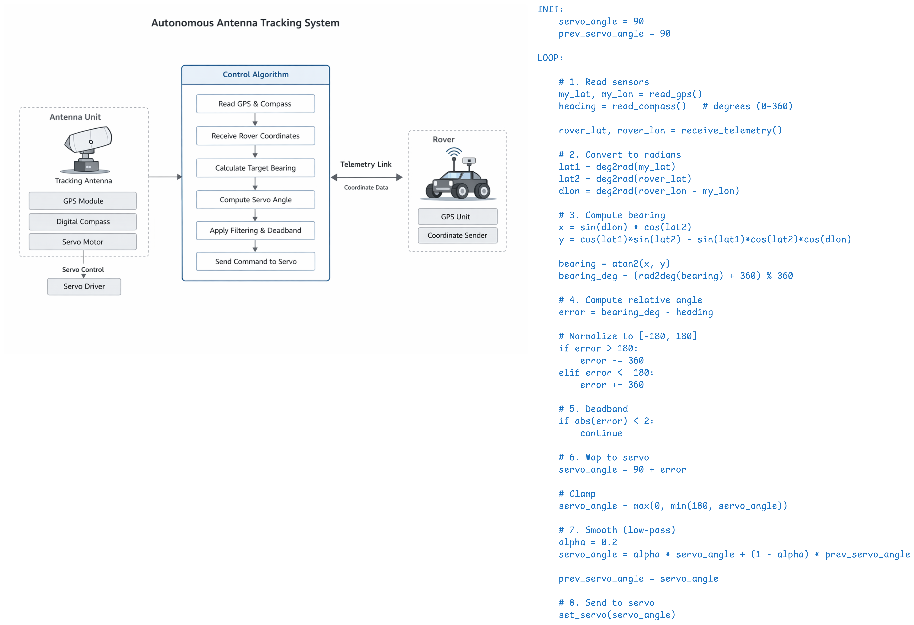

# RoverTrackingAntenna

Tracks the rover and faces the antenna towards the rover real-time.

## System Architecture

The Rover Tracking Antenna is a real-time directional tracking system that continuously aligns an antenna toward a rover using GPS and heading data.

### Data Flow

```text
Rover GPS (Telemetry)
	|
	v
Antenna GPS + Heading Sensors
	|
	v
Tracking Core (Math + Filtering)
	|
	v
Servo Control (Angle Output)
```

### Core Components

#### 1. Hardware Interface (`hardware_interface.*`)

Handles all hardware-specific operations:

- Antenna GPS acquisition
- Rover coordinate reception (telemetry)
- Compass/heading reading
- Servo control

Platform-dependent (ESP32 / Teensy).

#### 2. Tracking Core (`tracking_math.*`)

Implements platform-independent computation:

- Bearing calculation (antenna → rover)
- Distance estimation
- Heading error normalization
- Noise filtering (low-pass)
- Stability logic (deadband)

Fully portable and reusable.

#### 3. Application Layer (`code.ino`)

Main control loop:

1. Read sensor data
2. Compute bearing and heading error
3. Apply filtering and stabilization
4. Output final angle to servo

### Control Logic Overview

```text
error = normalize(bearing - heading)
error = apply_deadband(error)
error = low_pass_filter(error)

servo_angle = 90° + error
```

### Design Principles

- Real-time reactive system (no prediction)
- Separation of concerns (hardware vs logic)
- Cross-platform compatibility
- Low computational overhead (embedded-friendly)
- Noise-tolerant control

### Diagram


